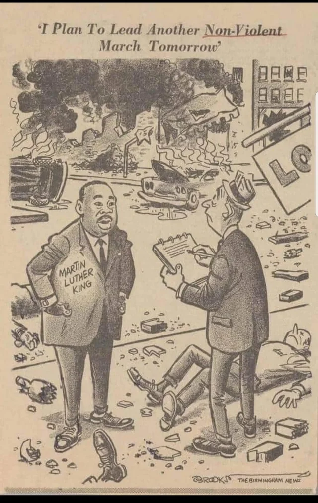

***Update 2023/08/14: I replaced dead twitter links with internet archive links.

I also want to note, this post has gotten me job offers, surprisingly. In the
words of the recruiting CEO: "It demonstrates you care."***

Hey bro,

So I've got to say I was a little shocked the other week when you said you'd
never voted before and it got me to thinking about a few other things you've
said over the years (like questioning climate change or whatever) and I realized
that you don't have near the obsession with politics I have so I figured I'd
share some thoughts about BLM to get out why I don't think it's a racist
organization and what I think about the current state of the movement and
country in that regard.

This letter is long, and contains many links. I encourage you to click them all.
The twitter threads in particular are extremely informative. The videos are
powerful and eye opening. This letter was very emotional for me to write, and I
hope you take it to heart.

---

First, [on the article you sent me][0], I looked into it.

The first thing I do whenever I see a story from a source I don't know is look
into the source itself, especially if it's claiming factual evidence. This
appears to be a minor blog on a local radio program out of Richmond. In 2020, I
like to have considerably more evidence for something before I start believing
it so I googled the query "black lives matter white people are sub human" and
found only tenuous evidence of that statement (basically only like 3 articles,
one referencing the Richmond one, and one being [Washington Times, a hatchet
job][1]. The author of that Richmond Radio piece, btw, is Jeff Katz, a right
wing hack. Search his name in Google News and it's pretty obvious.

All that said, I googled the girl's name and found this [Vice article about
her][2] which I haven't fully read but leads to a diving off point:

Her name is Yusra Khogali and she was a co-founder of the Toronto chapter of
BLM. Hardly an important person in the movement. And she came under fire when
she tweeted "Plz Allah give me the strength not to cuss/kill these men and white
folks out here today. Plz plz plz," in 2016 and my suspicion is she was forced
to resign. There's barely anything about her anywhere anymore.

So please, don't paint the largest protest movement in American history by one
rando chapter co-founder who has already been ostracized. That's just silly.

---

To address general racism in the black community and white permissiveness toward
it: yes, it exists. Specifically anti-semitism, and I have known it in my own
experience. 

I first learned of Hebrew Israelites through a close friend of mine, who was
black, and who was a member. You can read about them in [this Wikipedia
article][3]. Yes, it exists, and many of their chapters are bad. Not all of
them, and possibly not even a majority of them, but enough are Black
Supremacists that I cringe whenever they're in the news.

Let me clarify, though: My friend was in no way, shape, or form, a racist, and
he taught me a thing or two about the importance of people like Thurgood
Marshall in the civil rights movement. Hell, he believed he was more important
than MLK.

Another organization I am keeping an eye on is the [Not Fucking Around
Coalition][42]. I do not think there is anything wrong with black folk
exercising their second amendment rights (though, if you want a quick way to get
gun control passed, that's it). But in general, I hate separatism. Black
Separatism is as wrong as White Nationalism. We are a pluralist country, and
separatism is a direct threat to that pluralism. [The founder of NFAC is also an
anti-semite][4].

Louis Farrakhan is also a real racist anti-semite. So are Ice Cube and Nick Cannon.
These people are ostracized. If they are not, they should be.

My point is, black racism exists, should not be excused, ***but is not
mainstream black activism or politics. Mainstream black politics is John Lewis
and Elijah Cummings.***

---

As for the statues, yes they are racist and need to go. [Please, please, please
go watch this video on the history of Confederate Statues.][5] This letter will
still be here when you get back. They were, without exception, built as racist
statements in response to civil rights movements.  Most of the anti-removal
movements are anti-democratic rejections of local self-determination and
governance.

I am sure your larger problem is not with a locality deciding to remove a statue
because they find it offensive, it is more likely than not with the "tearing
down" of statues by protesting crowds.

And there things become more complicated. I will without a doubt say that I
prefer statues to be removed by legislatures than crowds. But I will not decry
the removal of a racist symbol by force, just as I will never decry violence
against Nazis. Yes, I do believe that the 1st Amendment protects speech, and I
do not believe the government should jail someone for being a Nazi. But I also
will never condemn anyone who wants to punch a Nazi in the face and suffer
whatever consequences may come for them. Likewise, I cannot personally criticize
a crowd for tearing down a racist statue. First of all, it's not some new
fanatical leftist fascist act as Trump wants to say (sorry, it is absurd to put
leftist and fascist in the same sentence), but a very old tradition in American
history, and [I doubt you'll say tearing down statues of King George III in the
American Revolution were acts of fascism or anarchy][6]. Second, it's very hard
to justify any municipality [keeping up a statue devoted to a white supremacist
in a town that is 97% black][39]. Finally, if there were statues to Nazis in the
United States, and people tore them down, would you be as offended?  Yet the
holocaust only lasted 4 years, whereas the slave trade lasted 400 years,
affected entire continents, and surely has a death toll far and above what was
suffered in the Shoah. On that alone, how can we justify a single statue to a
single confederate standing on our shores and call ourselves protectors of human
rights?

I am not going to bother litigating every case of every statue being torn down,
or democratically removed, or whether it should be or not. This is still a
democracy, and democracies are messy. Things that shouldn't be taken down are
taken down, people that shouldn't be cancelled are cancelled. But I will address
a few the right love to talk about.

1. [The Teddy Roosevelt statue in front of the New York Museum of Natural
   History][7] was not taken down because it was Teddy Roosevelt but because it
   was a racist statue. Scroll down and look at the statue from the front, the
   way a naked black man and a naked Indian were flanking Teddy on a horse. That
   statue is incredibly distasteful and I think you're sophisticated enough to
   recognize why. That said, [Teddy Roosevelt does have a questionable legacy
   that I think should be discussed.][40]
2. [The Abraham Lincoln statue taken down in Boston][8] was also not about
   Abraham Lincoln but about it being a racist statue, just like the Teddy
   Roosevelt statue. It is hard to say that the creator of that statue thought
   black people were equal to white people.
3. [The Fredrick Douglass statue][9] that was torn down is a very interesting
   case.  We literally have no idea whether it was torn down by angry crowds or
   white supremacists seeking retribution for the destruction of confederate
   statues.
4. [The statues toppled in San Francisco][10] are clearly examples of people
   tearing down statues of slave owners (Serra, [Francis Scott Key whose legacy I
   think should also be examined][41]; no I don't think we should change the
   National Anthem), getting caught up in a frenzy, and vandalizing Miguel
   Cervantes and Ulysses S Grant, which was stupid.  

---

Numbers 3 and 4 bring me to a deeper point I want to make about protest
movements and the organizations associated with them. Leaderless crowds are
dangerous. They get caught up in an angry frenzy and often do terrible things.
This is the nature of angry people. Organizations like BLM exist to channel that
anger into nonviolent, focused action. It is, for this reason alone,
self-defeating to criticize organizations like BLM for being violent. They are
not, they are the only thing keeping angry crowds from turning into violent
mobs.

What needs to be understood is that, just as there is a Fog of War, there is a
Fog of Protest. I've been going through my twitter scrapbook and I could provide
dozens of examples of misinformation and disinformation going around as part of
this movement and who is commiting violence. When you are dealing with large
groups of untrained people, there is going to be, inevitably, violence and
stupidity. Never judge a protest by individual protestors. The vast majority of
the protests since very early in this movement have been peaceful, because BLM
took charge of it. (Portland is another story, and I would address it separately
because I think it's hard to consider it properly a part of the BLM movement.)
The early riots were just angry people lashing out. People kept repeating an old
MLK quote that perfectly summed up why we were seeing riots: ["Riots are the
language of the unheard."][11]

---

Do not underestimate this movement. You are witnessing [the largest protest
movement in US history][12], and it is without a doubt in the top 5 largest
protest movements in world history. The civil rights movements in the 60's were
fairly small in comparison. This one is breath-taking in its scope. [Public
opinion has shifted faster and harder than almost ever in American history.][13]
There is something called the [3.5% Rule for social movements][14], that
"Nonviolent protests are twice as likely to succeed as armed conflicts – and
those engaging a threshold of 3.5% of the population have never failed to bring
about change." And it is nowhere near over. [What will probably end up being the
largest March on Washington in history is scheduled for August 28th.][43] *(update 2023: it was not.) The
entire political gravity of the United States has already shifted and we're
still only just now sorting out what that means.

[I don't care whether George Floyd has a long criminal record or not.][15]
Movements for justice are never morally clean, never complete, never perfect.
[Even the abolitionist movement had some questionable heroes who are still
morally ambiguous to this day.][16] If you allow little things like that to
cloud the moral clarity of the moment at hand you will be forever [justifying
the perpetuation of evil][17] by the [angry actions of the oppressed][18].

None of this is new. Time is a flat circle. See the comic.

---

You and I grew up in a wealthy, white suburb. We went to a wealthy, white
school. We were taught American history by white people. Some of our teachers
were pretty damn good (Mr. Kay, for one, who made clear that [Woodrow Wilson was
a racist, though perhaps not to the extent that I've since learned][44]) and
some of them were terrible. Nearly everything I have believed that was wrong
about the civil war and black history was taught to me by Mr. Maisner. Yes, our
high school has been an A rated school for a very long time. But that does not
mean we were taught the truth about American history.

I have always considered myself to be very knowledgeable about black history.
I've known obscure (to white people) names in black history for a very long
time. I've known about Emmet Till, Medgar Evers, Fred Hampton, Stokely
Carmichael, Booker T. Washington, and Marcus Garvey since I was a teenager. I
knew about the [Tuskegee Syphilis Experiment][45] and how that leads to [higher
rates of vaccine hesitancy among African Americans][46]. I read Fredrick
Douglass's autobiography when I was 15, Malcolm X's at 17.

I was wrong.

In the last year I have been absolutely stunned by entire aspects of American
history that have been kept from me. It started with the opening of Watchmen and
the Tulsa Riots. How could something so significant in American history have
been left out of our class? Since then I've learned about the actual
significance of Juneteenth, the importance of the song Lift Every Voice and
Sing, the Rosewood massacre here in Florida (did you know Florida has an actual
reparations program for Rosewood? I don't even know if anything like that exists
anywhere else in the US), and the Tampa race riots in 1967. [I learned that the
housing segregation in the United States is not the result of de facto
segregation as Mr. Maisner taught us, but the result of real racist government
policies.][19]

There are two American histories, this much has become clear to me. And it often
feels like even we, as white people, are victims of this horrific system of
apartheid that goes back before our nation's founding. We have been kept
deliberately ignorant of the horrific things our government has done and
continues to do to black people. This movement is not a surprise to historians,
to people who are aware of that horrific history, who have had open eyes for the
entire time.

- [This twitter thread perfectly sums up the anger black people feel, and why it
  spilled over into violence.][20]
- [This twitter thread sums up how pervasively corrupt the mentality of most cops
  are.][21]
- [This twitter thread shows how far back the history of police brutality and
  racism go.][22]
- And [this article][23] explains that white supremacists have long been infiltrating
  local police forces. I have seen [numerous videos][24] of [police officers flashing
  white power signs][25].

This is real, pervasive, and disgusting. We need a national commission on
deracistification just like we performed denazification in Germany. We need to
be firing entire police departments. The culture is rotten. No, not all police
are corrupt, but enough are. The "bad apples" trope is the most ignorant
response to tackling systemic racism I have ever heard. The full saying is not
"It's just a few bad apples." It's "A few bad apples spoil the barrel."

The police are agents of the state. They are trained professionals, [who should
behave professionally][47]. The protestors are untrained individual citizens. It
is for that reason *entirely* that we should judge the police by individuals,
but not the protests.

---

You and I have never understood [the pain][26] that is felt [by black people
every day][27]. That second video brings tears to my eyes every time I watch it.
[Black lives do not matter.][28] [They never have.][29] That is why the slogan
is so important. This horrible shit that we're barely taught about is not some
far and distant stuff that happened in a far away corner of the country in the
distant past. It is people's lives. They are shaped by it in ways we can never
unravel. Our lives, you and I, are shaped by it in ways we can never unravel. It
is [bad for the economy][30], [bad for our health][31], and [bad for our
country's standing around the world][32]. It is bad for the soul of our country.
Racism is so real and pervasive, and so real in black people's lives, just think
about what the guy in the CNN interview linked at the beginning of this
paragraph experiences. Think about the mountains of stress black people
experience on a daily basis, dealing with the police, dealing with racism,
dealing with discrimination. [Is it any wonder at all why they experience almost
double the rate of hypertension?][33] That paper says the causes are still
unknown. What a joke!

[Why do we not know about people like Robert Smalls?][34] Why are there no
statues to him? Why is he lost in the pages of history? Because he is black. Not
because he is not an interesting or important or compelling figure in American
history.  This is where we need to start. Reclaiming an entire strain of
American history for all Americans. Black folk are Americans. And no one should
ever fail to recognize it. Recognize that Robert Smalls is not Black History, he
is American History.

---

Perhaps the most controversial, most difficult things to deal with right now are
the way we treat national symbols and heroes. [A tweet went viral a month ago
that put red dots over all the slave owners in Turnbull's famous painting.][35]
It is shocking, and almost impossible to deny the racist, white supremacist
origins of our nation. Of course, John Adams was elevated in that painting,
because he was always an abolitionist, and I think you're aware that I've always
been a John Adams superfan. I ended up creating a [Twitter bot that tweets out
the letters between John and Abigail Adams every ten minutes][36]. But it is
impossible to deny that our nation was founded on racism.

I helped get a lot of guys their GEDs in prison. One thing that always stuck
with me was when one of my black students asked me how the Declaration of
Independence is not a lie. How could a racist like Jefferson, a man who owned
other human beings, write "All men are created equal"? I didn't have a good
answer for him.

None of us have good answers for this stuff.

I do not know that I believe we should remove statues of our founding fathers. I
will not answer one way or another. I know Biden does not want to remove them. I
know many black people do not want to remove them. They will probably not be
removed. But racism and white supremacy have been a stain on this nation since
before it's founding. We have to actually reckon with this. We have to
acknowledge that this country has two histories. Black Americans are Americans.
And they are in pain. *Americans are in pain*, and they need to be helped. The
moral clarity of that should be screaming out to all of us.

Questioning our nation's racist legacy is difficult. This is the nature of
democracy. If you decide Black Lives Matter is racist and anti-American because
some one or even many individuals are saying racist things, or because [one free
man uses his freedom to tweet a rejection of one of your dearest held
traditions][37], then you're rejecting something more fundamental than a protest
movement. You're rejecting democracy. You're rejecting the validity of their
opinions as Americans. Not as blacks. As Americans.

[Because this is what democracy looks like.][38]

And now I have to stop crying.

[0]: https://newsradiowrva.radio.com/blogs/jeff-katz/blm-leader-calls-white-people-subhuman-genetic-defects
[1]: https://mediabiasfactcheck.com/washington-times/
[2]: https://www.vice.com/en_ca/article/nzpk4q/why-i-dont-want-to-be-a-black-activist
[3]: https://en.wikipedia.org/wiki/Black_Hebrew_Israelites
[4]: https://twitter.com/antifashgordon/status/1279587110346002434?lang=en
[5]: https://youtu.be/otTsbqK4U7o
[6]: https://www.nationalgeographic.com/history/2020/07/pulling-down-statues-tradition-dates-back-united-states-independence/
[7]: https://www.nytimes.com/2020/06/21/arts/design/roosevelt-statue-to-be-removed-from-museum-of-natural-history.html
[8]: https://www.npr.org/sections/live-updates-protests-for-racial-justice/2020/07/01/886445904/boston-to-remove-statue-depicting-abraham-lincoln-with-freed-black-man-at-his-fe
[9]: https://www.nytimes.com/2020/07/07/nyregion/frederick-douglass-statue-rochester.html
[10]: https://sanfrancisco.cbslocal.com/2020/06/20/mayor-breed-destruction-statues-golden-gate-park-vandalism/
[11]: https://youtu.be/A-lWsXKRbeI
[12]: https://www.nytimes.com/interactive/2020/07/03/us/george-floyd-protests-crowd-size.html
[13]: https://twitter.com/FrankLuntz/status/1270015144337141760
[14]: https://www.bbc.com/future/article/20190513-it-only-takes-35-of-people-to-change-the-world
[15]: https://www.snopes.com/news/2020/06/12/george-floyd-criminal-record/
[16]: https://en.wikipedia.org/wiki/John_Brown_(abolitionist)
[17]: https://slate.com/news-and-politics/2020/05/george-floyd-protests-police-violence.html
[18]: https://www.officer.com/tactical/video/21143222/tampa-police-release-video-of-officers-being-ambushed-while-responding-to-call
[19]: https://youtu.be/2roWLzrqOjQ
[20]: https://twitter.com/C130Matt/status/1266408328864894977
[21]: https://twitter.com/ess_trainor/status/1269748616895348738
[22]: https://twitter.com/KevinMKruse/status/778572938463379457
[23]: https://www.thedailybeast.com/inside-the-new-push-to-expose-americas-white-supremacist-cops
[24]: https://www.reddit.com/r/Bad_Cop_No_Donut/comments/hlkxfb/policeman_in_oregon_flashing_a_white_power_sign/
[25]: https://web.archive.org/web/20200605170236/https://twitter.com/kikimurphy_/status/1266936387124826113/video/1
[26]: https://twitter.com/oliverdarcy/status/1266921926905286656
[27]: https://twitter.com/AntonioFrench/status/1266960975124717568
[28]: https://twitter.com/_SJPeace_/status/1268829526517256193
[29]: https://en.wikipedia.org/wiki/Cornerstone_Speech
[30]: https://www.npr.org/sections/live-updates-protests-for-racial-justice/2020/07/15/891434373/racism-has-an-economic-cost-atlanta-fed-president-warns
[31]: https://www.theguardian.com/world/2020/may/20/black-americans-death-rate-covid-19-coronavirus
[32]: https://foreignpolicy.com/2020/06/19/american-racism-foreign-policy-impact/
[33]: https://www.ahajournals.org/doi/full/10.1161/hypertensionaha.110.163196
[34]: https://web.archive.org/web/20200615001014/https://twitter.com/zachary_bl/status/1272318820410109954
[35]: https://twitter.com/jerrysaltz/status/1274007208020279303
[36]: https://twitter.com/john_and_abbie
[37]: https://twitter.com/Kaepernick7/status/1279463720318570497
[38]: https://twitter.com/ScottBrinton1/status/1268316436113612800
[39]: https://en.wikipedia.org/wiki/Tuskegee_Confederate_Monument
[40]: https://www.liherald.com/stories/was-teddy-roosevelt-a-racist-you-decide,126499
[41]: https://www.smithsonianmag.com/smithsonian-institution/wheres-debate-francis-scott-keys-slave-holding-legacy-180959550/
[42]: https://twitter.com/YourAnonCentral/status/1279561530548162560
[43]: https://wjla.com/news/local/what-we-know-so-far-about-the-2020-march-on-washington
[44]: https://www.vox.com/policy-and-politics/2015/11/20/9766896/woodrow-wilson-racist
[45]: https://en.wikipedia.org/wiki/U.S._Public_Health_Service_Syphilis_Study_at_Tuskegee
[46]: https://qz.com/1886133/us-healthcares-racist-history-helped-fuel-a-fear-of-vaccines/
[47]: https://web.archive.org/web/20200601001425/https://twitter.com/stevemullis/status/1266979219566989313
