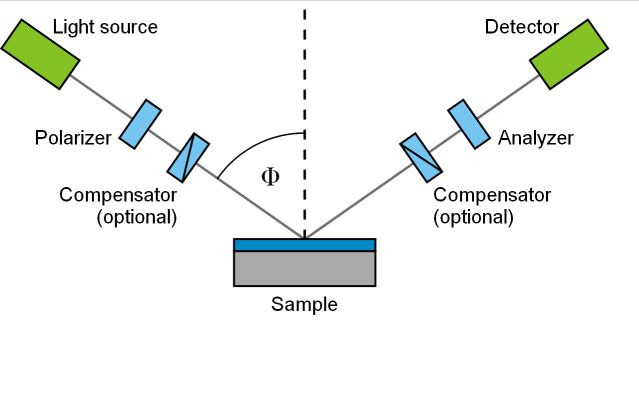

I rewatched Game of Thrones last week. It's still just as great and just as
terrible an ending as its ever been (in case you were curious if it changed).
But rewatching and rereading always results in new insights, and several things
struck me while watching this time around.

First, what a miracle we live in the modern world, without lords and ladies and
kings. At the end, all of the lords laugh at Sam's suggestion that they try
democracy. How incredibly presumptuous of them to think that _they_ can resist
the temptation to corruption with power.

I've written before on the nature of power, and how democracy and inclusive
institutions are the only stable system of government. If that suggestion comes
as a surprise to you, I suggestion you give [Why Nations Fail][wnf] a read.

But a more interesting result of rewatching was that I began to meditate on my
own job and my place in the world.

In Game of Thrones there isn't really a war for resources. Everyone just wants
power. _Except there is._ The resource is land, and in an agricultural society,
land is the most important resource for one reason: food production. It's
remarkable how much agriculture is disrupted by the wars for agricultural
resources in GoT. But wars for resources are always destructive of those
resources.

I started thinking about the present day, and, like I mentioned, how great it is
that we don't have to deal with that feudal bullshit. Because its true, and
awesome, but we _do_ have wars, and wars of resources. But what is the most
important resource of the today?

Well, obviously, semiconductors.

# My Job

A year ago I knew nothing about semiconductors. I still know nothing about
semiconductors, but I know a hell of a lot more than the average person now.

I work as a contractor for a company that does ellipsometry, providing tools to
the big semiconductor houses (TSMC, Intel, Samsung, Hynix, etc., etc.). I have
never done anything more interesting in my life.

To sum up what we do: imagine a [silicon wafer][wafer]. Onto this is printed an
integrated circuit. The process of photolithography is basically of five steps
(this is highly simplified but about as good as I can explain, and understand):

1. Coat the wafer in "photoresist", a chemical can be baked and then etched.
2. Etch your pattern into the photoresist with a laser.
3. Use a "developer" to remove the parts of the photoresist coating that you
   "etched."
4. Lay on your material for the structures.
5. Remove the photoresist

When I say this is highly simplified, I really mean this could be completely
wrong, I'm not really sure, and will be looking into it more again to understand
better. (This job has required more repeated learning of concepts than anything
I've heretofore tried to master.) For a better introduction to photolithography,
see the amazing channel of [Sam Zeloof, Garage Fab Extraordinaire][zeloof]

Regardless, this process produces, essentially, nanotechnology. That is,
structures on the order of nanometers. You can't look at this stuff with a
microscope, and a laser would be too coarse and probably destroy the chip, so
you have to use special techniques to figure out if what you want on the chip is
what you put on the chip. So we have [Rigorous Coupled Wave Analysis][rcwa], and
ellipsometry.

There is no way in hell I'm getting into the math and physics of this, but the
principle is pretty simple:

1. Shine a light at an angle at the wafer.
2. Position a camera at the opposite end of the reflection (remember, light will
   reflect at an equal Angle of Reflection to the Angle of Incidence).
3. Capture that light, and do some fancy math (RCWA) to figure out what the
   dimensions of the structure on the board are.

This stuff is insanely math intensive, insanely performance dependant, and
insanely important. Linear Algebra, Calculus, and Machine Learning are all
pretty essential parts of this job. It feels like working towards a masters
degree and getting paid a lot of money to do it.

But the thing that feels truly incredible: the level of precision required in
these fabs is beyond anything the world has ever had to use. This is the most
advanced manufacturing in the history of the world. Hands down. And I'm a part
of the tool chain (in an incredibly small way, sure) that helps reach that level
of precision.

I feel like a seventeen year old kid that lied on his military application and
ended up at Midway. I've never formally studied mathematics or computer science,
and I'm the dumbest guy in every Teams room, but I'm actually helping and
producing.

One of our products recently had a release. I contributed some code on it that
lead to a performance improvement of about 14% in one particular operation. I'm
far from the only one who contributed to this, but that release (which had more
than just my speed improvement) lead to apps people at TSMC being able to go
home earlier than they used to. Christ that feels good to know. I actually did
something that mattered, even if in a small way.

# Helping Build the Arsenal of Democracy

The Great Wars of the future will not be fought over oil. This is increasingly
obvious as the world transitions away from fossil fuels. They will be fought
with, and over, semiconductors.

We all know what war I'm talking about. Taiwan is a jewel. TSMC and Intel are
the twin kings of Semiconductors, and TSMC dwarfs Intel's market cap. (Samsung
and Nvidia actually lead Intel and TSMC respectively, but Samsung is mostly
specialized in memory and Nvidia doesn't have fabs). If China were to invade
Taiwan, I can think of four results:

1. China blockades Taiwan and a huge portion of the world's semiconductors are
   sidelined.
2. China scuttles TSMC and a huge portion of the world's semiconductors are
   sidelined.
3. Taiwan scuttles TSMC and a huge portion of the world's semiconductors are
   sidelined.
4. America scuttles TSMC and a huge portion of the world's semiconductors are
   sidelined.

Even worse is when you start thinking about the semiconductor tool supply chain.
Look at this [map of ASML locations][asml]. (ASML, if you're unfamiliar, is a
Dutch company that produces semiconductor manufacturing machines; as far as I
understand, they're the only producers of EUV machines.) Six (Six!) of their
sixteen locations are in China or Taiwan. I have no idea what those locations
are specialized in (its easy to imagine the Taiwanese plants being specialized
in EUV) but even pretending they're fungible locations, that's almost 40% of the
world's semiconductor tool chain going offline overnight in the event of an
invasion of Taiwan. My God.

Imagine the 2020-22 chip shortage on steroids. Christ. It would be an economic
bloodbath.

Things are going to get interesting in the next 10 years. And I have a front row
seat. 🫠

# The Game of Sand

The Game of Thrones was about a seat of power for controlling the most important
resource in the Seven Kingdoms: the Seven Kingdoms themselves. In a post
agricultural society, land isn't anywhere near as valuable. We can produce
massive amounts of wealth and value on small land footprints. Imagine the most
valuable plot of land in an agricultural society, and now imagine the most
valuable plot of land in the post-industrial world of today. In the former, we'd
say the largest plot of arable land. In the latter, we'd say somewhere in
downtown Manhattan.

Or Taiwan.

Silicon wafers are created with thousands of chemicals, from the humble sand to
the noble neon. None of these resources come from Taiwan. But there is one
element that does: know-how. Kill all the Taiwanese and you have some useless
clean rooms. Leave Taiwan intact and you have semiconductors.

The most important resource today is not physical. It's a type of know-how. The
know-how to make integrated circuits.

Land can be controlled by just a single man, paying a lot of dumb powerless
people to control it. But Know-How can only be controlled through the
cooperation of all the people that know how. If there is a more succinct
demonstration of how democracy has triumphed in the modern world, I haven't
found it.

[wnf]:
  https://www.amazon.com/Why-Nations-Fail-Origins-Prosperity/dp/0307719227/ref=sr_1_1?crid=XQ5R3B73L02W&keywords=why+nations+fail&qid=1659731931&sprefix=why+nations+fail%2Caps%2C132&sr=8-1
[wafer]: https://en.wikipedia.org/wiki/Wafer_(electronics)
[zeloof]: https://www.youtube.com/c/SamZeloof
[rcwa]: https://en.wikipedia.org/wiki/Rigorous_coupled-wave_analysis
[asml]: https://www.asml.com/en/company/about-asml/locations
